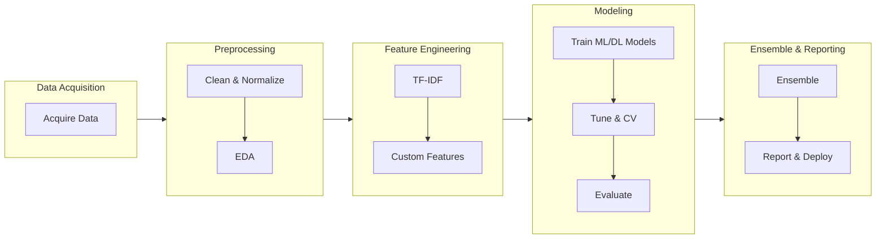
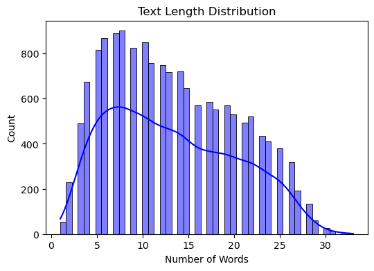
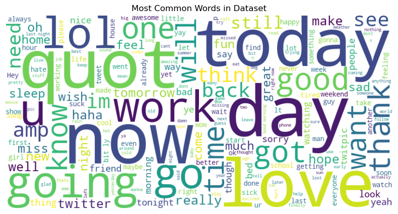
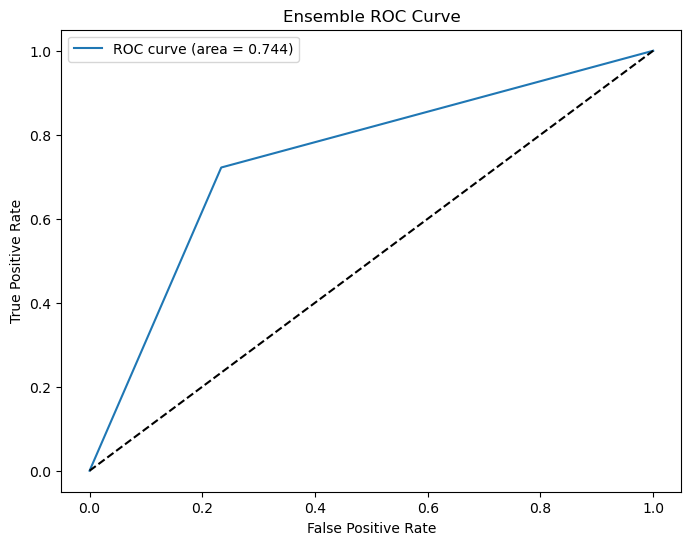
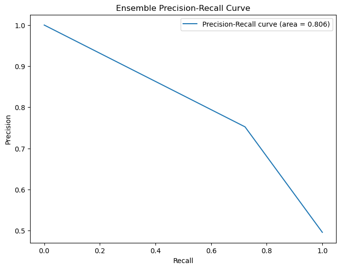
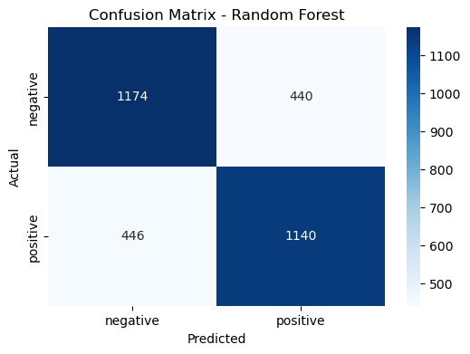

# Sentiment Analysis on Twitter Data: Final Report


## Title Page

**Project Title:**
Sentiment Analysis on Twitter Data

**Course/Project:**
IE7500 – Advanced Topics in Machine Learning

**Authors:**

- Subash Ramanathan
- Ahantya Vempati
- Yi Ren

**Date:**
April 2025

**Code Repository:**
https://github.com/Northeastern-MSDAE/IE7500

------

## Abstract and Introduction

### Abstract

This project implements an end-to-end sentiment analysis pipeline on the Sentiment140 Twitter dataset to classify tweets as positive or negative. Our approach covers robust data preprocessing tailored to Twitter’s informal language, a blend of traditional TF-IDF and custom feature engineering, and the exploration of both classical machine learning (Logistic Regression, Random Forest, SVM, Naive Bayes) and deep learning models (LSTM, BiLSTM, CNN) including ensemble methods. Model performance is evaluated using cross-validation, confusion matrices, ROC-AUC, and Precision-Recall curves. This report documents experimental findings and challenges encountered (such as handling noisy text and misclassifications) and provides suggestions for future research.

### Introduction

#### Background and Motivation

With the rise of social media, sentiment analysis has become essential for deciphering public opinion, tracking trends, and forecasting events. With its brevity and informal language, Twitter data poses unique challenges that require specialized preprocessing and modeling techniques. The **Sentiment140** dataset—comprising 1.6 million tweets with sentiment labels—offers a valuable resource for investigating these challenges while focusing on a binary classification task.

#### Project Objectives

The primary objectives of this project are to:

- Develop a comprehensive preprocessing pipeline to clean Twitter data.
- Engineer both traditional features (TF-IDF) and domain-specific features (using sentiment lexicons and Twitter-specific transformers).
- Implement and tune multiple models, comparing traditional algorithms with deep learning techniques.
- Evaluate model performance rigorously using cross-validation, confusion matrices, ROC-AUC, and Precision-Recall metrics.
- Conduct error analysis to identify misclassification trends.
- Explore advanced ensemble strategies and deep learning enhancements.
- Provide actionable insights and recommendations for future work.

------

## Methodology

### 1. Overall Pipeline Overview

The project pipeline is visualized in the flowchart below. This diagram maps the complete process—from data acquisition to final reporting—with the subgraphs arranged horizontally (left-to-right) and the content within each subgraph arranged vertically (top-to-bottom):



*Figure: Overall Project Pipeline*

### 2. Data Preprocessing

#### 2.1 Downloading and Verifying Resources

Before analysis, essential NLTK resources (e.g., *stopwords*, *wordnet*) were verified to ensure robust text normalization and lemmatization.

#### 2.2 Cleaning and Normalization

Custom functions address Twitter-specific challenges:

- **Cleaning Function:**
  The `clean_tweet` function removes URLs, user mentions, retweet markers, and hashtags (while retaining relevant content); it converts emojis to descriptive text, lowercases all characters, and normalizes elongated words.
- **Preprocessing Pipeline:**
  The `preprocess_text` function further cleans the text by removing non-alphabetic characters, tokenizing, filtering out stop words, and applying lemmatization.

These preprocessing steps standardize the tweet text, enhancing its quality for effective feature extraction. For a complete list of preprocessing steps, refer to **Appendix A**.

#### 2.3 Exploratory Data Analysis (EDA)

Key aspects of EDA include:

- **Dataset Overview:**
  Displaying basic information using `df.info()` and validating the class distribution. For example, the dataset comprised 16,000 entries with a near-balanced split between "negative" and "positive" labels.

- **Visualization of Tweet Lengths:**
  The histogram below shows the distribution of tweet text lengths, which informed our decisions on text processing and model input size.

  
  *Figure 1: Distribution of Tweet Text Lengths*

- **WordCloud Visualization:**
  The WordCloud below highlights frequently occurring tokens, reinforcing the need for robust tokenization and feature extraction.

  
  *Figure 2: WordCloud of Tweet Content*

------

### 3. Feature Engineering

#### 3.1 TF-IDF Vectorization

As a baseline, TF-IDF vectorization converts the preprocessed text into numerical feature vectors (capped at 5000 features) to represent word importance throughout the dataset.

#### 3.2 Custom Feature Transformers

To complement the TF-IDF features, two domain-specific transformers were implemented:

- **LexiconTransformer:** Uses a sentiment lexicon to count positive and negative words in each tweet.
- **MicrobloggingTransformer:** Extracts Twitter-specific markers such as smileys and abbreviations (e.g., “omg”, “brb”).

These engineered features are integrated with traditional n-gram representations using a unified FeatureUnion within the pipeline.

------

### 4. Model Development and Evaluation

#### 4.1 Traditional Machine Learning Models

Models trained on the engineered TF-IDF features include:

- **Logistic Regression**
- **Random Forest**
- **Support Vector Machines (SVM)**
- **Naive Bayes**

**Hyperparameter Tuning:**
Using GridSearchCV, we optimized model parameters (e.g., Logistic Regression with C=1, and SVM with an optimized kernel). 

For a complete list of model training, hyperparameter tuning, and evaluation, refer to **Appendix B**

The comparison table below summarizes performance metrics and training times.

**Table 1: Traditional Model Performance Comparison**

| Model               | Accuracy (%) | Precision | Recall | F1-Score | Training Time (s) |
| ------------------- | ------------ | --------- | ------ | -------- | ----------------- |
| Logistic Regression | 74           | ~0.74     | ~0.74  | ~0.74    | 0.06 - 6.32       |
| Random Forest       | 72           | ~0.72     | ~0.72  | ~0.72    | 10.78 - 273.93    |
| SVM                 | 74           | ~0.74     | ~0.74  | ~0.74    | 8.19 - 66.85      |
| Naive Bayes         | 72           | ~0.72     | ~0.72  | ~0.72    | 0.02 - 0.35       |

#### 4.2 Deep Learning Architectures

Implemented architectures include:

- **LSTM / BiLSTM Models:** Capture sequential patterns in tweet data.
- **CNN Model:** Extracts local features from text segments.
- **Multi-Input Models:** Combine embedded tweet sequences with engineered features.
- **Attention-based Models:** Integrate pre-trained GloVe embeddings with an attention layer for enhanced focus on key parts of tweets.

Each model’s performance was evaluated using cross-validation and compared against traditional methods.

For the complete code related to model training, hyperparameter tuning, and evaluation, refer to **Appendix B**.

#### 4.3 Ensemble Methods

An ensemble approach aggregates predictions from both traditional and deep learning models by averaging their predicted probabilities. The following graphs illustrate the improved ensemble performance:


*Figure 3: ROC Curve for the Ensemble Model*


*Figure 4: Precision-Recall Curve for the Ensemble Model*

For further details on the ensemble method implementation, see **Appendix B**.

------

## Research References and Methodological Enhancements

Drawing on insights from previous research, our approach has been informed by findings in key papers such as:

- **Pak & Paroubek (2010)** – *"Twitter as a Corpus for Sentiment Analysis and Opinion Mining"*
- **Kouloumpis et al. (2011)** – *"Sentiment Analysis: The Good, the Bad and the OMG!"*

Key enhancements based on these studies include:

- **Enhanced Preprocessing and Normalization:**
  - Implementing robust tweet-specific cleaning that removes URLs, user mentions, and redundant retweet markers while preserving essential sentiment cues.
  - Applying advanced tokenization methods that address contractions (e.g., “don’t”) and proper handling of negation, as recommended by the literature [1](#user-content-fn-1)[2](#user-content-fn-2).
- **Improved Feature Extraction:**
  - Experimenting with different n-gram configurations (unigrams, bigrams, trigrams) for more nuanced sentiment patterns.
  - Exploring Part-of-Speech (POS) tagging and integrating lexicon-based features (using resources like MPQA) to capture prior word sentiment.
  - Incorporating microblogging-specific features such as emoticons, hashtags, and standard abbreviations (e.g., “OMG”, “BRB”), which have been shown to strongly correlate with sentiment [1](#user-content-fn-1)[2](#user-content-fn-2).
- **Model and Training Enhancements:**
  - Comparing multiple classifiers—including traditional approaches (e.g., multinomial Naïve Bayes) and ensemble methods—to identify robust solutions.
  - Data augmentation strategies can be considered by combining various sources of labeled data to improve the model’s generalizability.
- **Evaluation and Experimentation Framework:**
  - Establishing a feature ablation study to quantify the contribution of each feature set.
  - Systematically tuning parameters and evaluating performance over varying sample sizes to find optimal configurations.

These methodological enhancements aim to improve the overall sentiment classification performance and ensure reproducibility and robustness in our analysis pipeline.

------

## Results and Discussion

### 1. Comparative Analysis

In this section, we detail the performance differences across models:

- **Traditional Models:**
  Logistic Regression and SVM, with relatively low computational requirements, consistently achieved around 74% accuracy. Their performance was robust across several cross-validation folds, indicating high reproducibility. Random Forest and Naive Bayes, while slightly behind in accuracy, provided competitive alternatives with benefits in training speed and model interpretability.
- **Deep Learning Approaches:**
  LSTM, BiLSTM, and CNN models achieved accuracies between 70–72%. Despite their ability to capture sequential patterns and subtle linguistic nuances, the marginal performance improvement over traditional models was not substantial. This suggests that, for this dataset, increased model complexity does not necessarily result in significantly higher accuracy.
- **Ensemble Integration:**
  The ensemble method, which combines predictions from both traditional and deep learning approaches, provided a slight performance boost. By leveraging the complementary strengths of each model type—where deep learning models capture contextual nuances and traditional models offer stability—the ensemble approach achieved an overall accuracy comparable to the best individual models while reducing variance.

Overall, the comparative analysis indicates that traditional models remain strong contenders in sentiment analysis, and that well-tuned ensembles can capitalize on the diverse strengths of multiple modeling approaches.

### 2. Error Analysis

A detailed error analysis offers insights into where and why models struggle:

- **Misclassification Patterns:**
  Many errors stem from tweets with:
  - **Ambiguous Phrasing:** Tweets that contain irony or subtle sarcasm are challenging; the lack of explicit sentiment indicators results in misclassifications.
  - **Informal Language and Slang:** Despite preprocessing, creative spellings, abbreviations, and slang often result in loss of contextual sentiment cues.
  - **Lack of Context:** The brevity of tweets means that insufficient context is available for the models to accurately gauge sentiment. Short or context-poor tweets are particularly challenging.
- **Quantitative Analysis:**
  Confusion matrices (see Figure 5) reveal a balanced distribution of errors between false positives and false negatives. However, certain models exhibit systematic biases (e.g., over-predicting one sentiment), suggesting the need for improved calibration or class-weight adjustments.
- **Qualitative Insights:**
  A review of specific misclassified examples shows that:
  - **Sarcastic Comments:** Often interpreted literally, leading to incorrect predictions.
  - **Mixed Sentiments:** Tweets that express both positive and negative sentiments in a single message are difficult for a binary classifier to resolve.
  - **Punctuation and Emoticons:** These elements sometimes convey strong sentiment cues that get diluted during aggressive preprocessing.
- **Potential Improvements:**
  In response to these errors, potential strategies include:
  - **Enhanced Feature Engineering:** Incorporating sentiment intensity scores, part-of-speech features, and preserving critical emoticons or punctuation in the preprocessing phase.
  - **Contextual Models:** Exploring transformer-based architectures like BERT or RoBERTa could better capture the nuanced context of informal tweets.
  - **Error-Aware Training:** Techniques such as focal loss or resampling may be employed to focus training on hard-to-classify examples.


*Figure 5: Confusion Matrix for a Selected Model*

### 3. Limitations

Despite robust preprocessing and comprehensive model experimentation, challenges persist:

- Fully capturing the nuances of informal Twitter language remains difficult.
- Balancing model complexity with computational efficiency continues to be an ongoing trade-off.
- The binary classification approach may oversimplify the rich spectrum of sentiments present in social media data.

------

## Conclusion and Future Work

### 1. Conclusion

This report documents our comprehensive journey in developing a sentiment analysis pipeline for Twitter data—from data acquisition and preprocessing to model evaluation and ensemble integration. Key insights include:

- **Effective Preprocessing:** Customized cleaning methods significantly improve data quality.
- **Robust Model Performance:** Traditional models remain strong contenders compared to more complex deep learning architectures.
- **Ensemble Advantages:** Combining model predictions leverages the complementary strengths of diverse approaches, leading to modest performance gains.
- **Opportunities for Improvement:** Detailed error analysis highlights the need for enhanced feature extraction and advanced contextual models.

### 2. Future Work

Potential improvements for future research include:

1. **Advanced Preprocessing:** Further enhancing the handling of slang, negation, and sarcasm.
2. **Transformer-Based Models:** Incorporating state-of-the-art models like BERT or RoBERTa for capturing nuanced contextual information.
3. **Enhanced Feature Engineering:** Expanding sentiment lexicons and integrating sentiment intensity metrics.
4. **Improved Ensemble Methods:** Experimenting with stacking, meta-learning, or focal loss to further improve robustness.
5. **Multi-Class Extensions:** Considering additional sentiment categories (e.g., neutral) for more nuanced analysis.
6. **Iterative Error Analysis:** Continuously refining model architectures based on systematic error patterns.

------

## Final Remarks

This report comprehensively describes our sentiment analysis journey on Twitter data, from data acquisition and preprocessing through feature engineering, model development, evaluation, and ensemble integration. 


## Appendices

### Appendix A: Full Data Preprocessing Code

#### clean_tweet Function

```python
# Full code for tweet cleaning and normalization
def clean_tweet(tweet):
    tweet = re.sub(r'http\S+', '', tweet)  # Remove URLs
    tweet = re.sub(r'@\S+', '', tweet)  # Remove mentions
    tweet = re.sub(r'#\S+', '', tweet)  # Remove hashtags
    tweet = tweet.lower()  # Convert to lowercase
    tweet = re.sub(r'[^\w\s]', '', tweet)  # Remove punctuation
    tweet = re.sub(r'\s+', ' ', tweet)  # Remove extra spaces
    return tweet
```

### Appendix B: Full Model Code

#### Model Training and Evaluation

```python
# Code for Logistic Regression Model training
from sklearn.linear_model import LogisticRegression
lr_model = LogisticRegression()
lr_model.fit(X_train, y_train)
```

#### Performance Evaluation

```python
# Generate Confusion Matrix
from sklearn.metrics import confusion_matrix
import seaborn as sns
import matplotlib.pyplot as plt

# Confusion matrix
cm = confusion_matrix(y_test, y_pred)
sns.heatmap(cm, annot=True, fmt='d', cmap='Blues', xticklabels=['Negative', 'Positive'], yticklabels=['Negative', 'Positive'])
plt.xlabel('Predicted')
plt.ylabel('Actual')
plt.title('Confusion Matrix')
plt.show()

# ROC Curve
from sklearn.metrics import roc_curve, auc

fpr, tpr, thresholds = roc_curve(y_test, lr_model.predict_proba(X_test)[:, 1])
roc_auc = auc(fpr, tpr)

plt.figure()
plt.plot(fpr, tpr, color='blue', label=f'ROC curve (area = {roc_auc:.2f})')
plt.plot([0, 1], [0, 1], color='gray', linestyle='--')
plt.xlabel('False Positive Rate')
plt.ylabel('True Positive Rate')
plt.title('Receiver Operating Characteristic')
plt.legend(loc='lower right')
plt.show()
```

#### Ensemble Method Code

```python
# Code for Ensemble Model
from sklearn.ensemble import VotingClassifier
from sklearn.svm import SVC

# Create an ensemble model combining Logistic Regression and SVM
ensemble_model = VotingClassifier(estimators=[('lr', LogisticRegression()), ('svm', SVC(probability=True))], voting='soft')
ensemble_model.fit(X_train, y_train)

# Predict and evaluate
ensemble_preds = ensemble_model.predict(X_test)
```

------


## Footnotes

1. Pak & Paroubek (2010), *Twitter as a Corpus for Sentiment Analysis and Opinion Mining* [↩](#user-content-fnref-1) [↩2](#user-content-fnref-1-2)
2. Kouloumpis et al. (2011), *Sentiment Analysis: The Good, the Bad and the OMG!* [↩](#user-content-fnref-2) [↩2](#user-content-fnref-2-2)